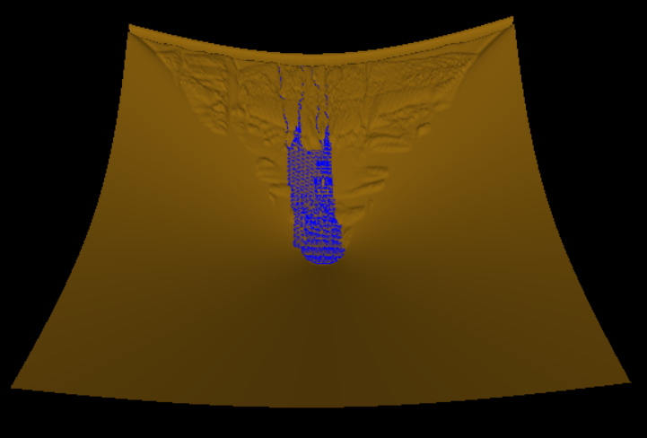

## SUMMARY

We implemented a hydraulic erosion model for procedural terrain generation to produce more natural looking landscapes in real time.
- Computed a 1024x1024 heightmap in no more than 2ms per cycle.
- We implemented 3 key parallel approaches and have presented their results.
- Capable of operating on continuously scrolling terrain instead of a fixed heightmap on NVIDIA GTX 1050.

You can download the PDF of this report [here](Renderer/docs/15618_Project_Report.pdf).

---

## BACKGROUND
Procedurally generated heightmaps have been used to quickly create large height maps for video game terrain for decades. However, purely procedural techniques ultimately lack the natural qualities present in real landscapes.  A common method for increasing the realism of terrain is to model hydraulic erosion; the simulation of the flow of water removing and transporting surface material. However, modelling erosion accurately requires performing calculations on every cell of the heightmap being eroded for many iterations. This presents a significant bottleneck for CPU programs and a significant opportunity for parallelization with GPU’s.

---

## APPROACH
The key insight into our approach is that given enough information at the start of an iteration, instead of calculating the impact each cell has on its neighbors and distributing the results (mimicking what happens in real life), each cell can simply calculate the impact its neighbors would have on it, and adjust accordingly. This has several benefits for parallelization which be discussed after the description of the erosion mathematics.

### Erosion Algorithm Description
The final algorithm implemented is an abstraction away from true hydraulic erosion, in particular, there is no concept of persistent velocity between iterations, all water movement is based on the terrain and water distribution at the time of calculation. This allows a simplified calculation of erosion, where all of the water volume on a cell that can move at each timestep does so if it can.

At every time step, each cell performs the following calculations:
1. Get the difference in water height to each neighbor.
2. Calculate Outflow:
  - Sum the difference in height between self and each neighbor of lower height, store as outflow.
  - Subtract outflow from current water volume.
  - Subtract an equivalent fraction of sediment from the sediment total.
3. Calculate Inflow:
  - For each neighbor of greater height, use the stored outflow to calculate how much water flows into cell, store as inflow.
  - Add inflows to current water volume.
  - Add equivalent portion of neighbor sediments to the current cell sediment total.
4. Calculate new erosion and deposition:
  - Define process constants ABRASION, SOLUBILITY, and DEEP_WATER_CUTOFF, which respectively determine how much material is removed by flowing water, how much material can be held in water, and the depth of water at which point adding water no longer
erodes the terrain beneath it.
  - Define sediment capacity as SOLUBILITY*(water volume)
  - Define cell erosion as ABRASION*(inflow+outflow), moderated by DEEP_WATER_CUTOFF.
  - Remove all cell erosion from the terrain height, adding to sediment total.
  - Add all sediment over the sediment capacity to the cell as terrain, removing it from the sediment total.
5. Estimate new outflows using new height values.
6. Add water volume to the heightmap, using a separate kernel and the rain map. This kernel is extremely simple (a single addition operation) and will not be discussed further.

These steps are repeated every iteration.  In practice, because the process is heavily discretized and there is an assumption that all water moves every iteration, the inflow and outflow values are damped to prevent undesired oscillation in large bodies of still water (this effectively adds a very simple sense of velocity to the calculation). A value of b=.25 gave good results.

### Mapping to the GPU

#### GPU processing layout and global memory allocation

The current version of the algorithm takes in a heightmap, a profile for applying water to the heightmap, and several parameters that change how the erosion process behaves. It assumes a square heightmap of an integral number of block widths, so it can create a number of 2D blocks such that each cell is given its own thread. In practice, we hardcode blocks of width and height 16.

The heightmap and rain profile are copied to the GPU as single dimensional vectors. In addition to the height, we also store the volume of water, amount of sediment, and expected outflow (more on this later) from each cell, each in their own 1D vector. 

We maintain separate input and output buffers for each iteration, so in practice we store two copies of each of the above arrays on the GPU.

#### Shared Memory

Each CUDA block is mapped to a contiguous square portion of the input heightmap. Because the algorithm relies on each cell accessing lots of information about its neighbor (each value is accessed approximately five times), significant gains can be made by loading those frequently shared data into shared memory. 
This is very easy to do for all of the actual data in a block, but the edges of a block require information from other blocks. For the sake of simplicity in writing other portions of the code, for each simulation parameter, we define an array in shared memory that is BLOCKDIM+2 wide and tall, allowing us to store those edge values in shared memory as well, despite the fact that each is only used by one cell. The “corner” values of this larger array are never accessed or populated. A depiction of this array is shown below.  

Cell height, water volume, sediment volume, and expected outflow are all loaded in this fashion. 

#### Synchronization

Significant care was taken to reduce the need for synchronization. Currently, the only synchronization events occur after a kernel finishes executing, and after the shared memory load inside each block. 

This is possible for two reasons: first, we maintain separate input and output buffers. This allows us to guarantee that the input buffer is read only, meaning we do not need synchronization to read from it. 

The second reason is the aforementioned assumption that each cell can calculate the inflow from its neighbors. Under a normal mental model of erosion, outflows and inflows from each cell are values calculated during each update step, and discarded in between iterations. Calculating erosion this way requires each cell to synchronize updates to all of its neighbors, creating a significant quantity of either extra memory operations and/or synchronization traffic. However, in the mathematical model described above, the only information a cell needs to calculate how much water is flowing into it that it does not already have is how much water is flowing out of its neighbor in total. Storing this value allows each cell to fully determine its own state for the next iteration, with the exception of outflow. To save the computational effort of running an extra kernel to perfectly determine outflow, we simply estimate it using current values of outflow and inflow, which gives reasonably accurate erosion results. 

### Previous Attempts

Our initial implementation used a structure that contained all the information relevant to a single cell, and the created an array of that structure. Profiling revealed significant latency issues due to uncoalesced data accesses, so we switched from an array-of-structs paradigm to a struct-of-arrays paradigm, which resulted in a 5x-10x speedup, depending on the kernel. 

Understanding the bottleneck of our previous approach we attempted to use shared memory in collaboration with some atomic instructions but faced problems near the boundaries. The improper shifting of sediments to the neighbouring cells used to cause a pattern in which the terrain on the boundaries of the blocks would show some protrusion. So realising all the problems and bottlenecks we resorted to the solution mentioned above.

Also, we used two buffers for each data element, operating on one and updating the other. The OpenGL pointer to the vertex_buffer was switched at each display call to render seamlessly.

We started with implementing a simple approach were the water levels of the neighboring cells were compared and the movement of water and the sediments to the neighboring cells was calculated. However, this approach involved too much talk-over with the surrounding cells and caused a lot of atomicity issues. Initially, we used a global memory and the cell values would be written to the global memory using atomic operations. However, this strategy was very slow as each cell would read and written to by 4 of its neighbours for 3 data elements -  height, water and erosion.

---

## RESULTS

### Computation Time
We ran the algorithm at a number of grid sizes and timed how long it took to perform 10 iterations of the algorithm. The charts below presents the time in milliseconds it took to run a single erosion step at various sizes. In general, time to compute increased linearly with the number of cells being evaluated.

The machine used to test the algorithm was a Geforce GTX 1050, which has only 2GB of RAM. Attempts to run on grid sizes larger than 4096 ran into memory allocation errors.

### Profiling Results
Heavy use of the Nvidia Visual Profiler was made during the development of this algorithm. It has consistently indicated throughout development that the largest bottleneck to improved performance is instruction latency.

The “other” category in a compute capability 6.X device indicates that the algorithm spends most of its time waiting on branch divergence or register overflows. Branch divergence is significantly more likely.
The mathematical portion of the algorithm encounters several areas where division by zero occurs when there is no water in a cell. Checking for that creates high rates of divergence when a block contains a boundary between a watery area and a dry area. In addition, the algorithm relies heavily on min and max functions to keep certain values (mostly water volume) at or above zero. This presumably creates a large number of conditionals that will evaluate differently for different threads. 
In addition, the grids loaded in shared memory are larger than a block, so numerous conditionals are used to fill in the additional areas and these are possibly not well warp-aligned. 

---

## References
- Xing Mei, Philippe Decaudin, Bao-Gang Hu. Fast Hydraulic Erosion Simulation and Visualization on GPU.
- CUDA Programming Guide
- Youtube channel - OpenGL, TheChernoProject
- Woo, Neider et Al., Chapter 4 Lights and Materials.

---

---

## GOALS AND DELIVERABLES

### Goals
- Render a 1024x1024 heightmap in no more than 5ms per cycle
- Capable of operating on continuously scrolling terrain instead of a fixed heightmap
- Multiple terrain materials with different erosion mechanics
- Persistent rivers/bodies of water

### Stretch Goals
- Non-hydraulic erosion methods
- Voxel-based erosion instead of heightmap erosion

### Deliverables
- Working CUDA code and loading-unloading program
- Documentation in the form of a Report.

## PLATFORM CHOICE
We plan to make this project usable for video games and so will be using some ubiquitous NVIDIA hardware that is available to us. The specifics are:
- GeForce® GTX 1080 Ti 
- GeForce® GTX 1050 Ti 

---

## POSTER SESSION
Poster demonstrating the algorithm implemented and a live demo on one of our laptops showing the algorithm in process and iteration times. 

---

## SCHEDULE

| Description | Date |
| --- | --- |
| Determine algorithms for base heightmap generation, height map rendering environment. | Nov 05, 2018 |
| Implement basic height map generation algorithm. Design algorithm for hydraulic erosion. | Nov 12, 2018 |
| Begin implementation of an algorithm for hydraulic erosion. | Nov 19, 2018 |
| Finish implementation of the algorithm. | Nov 26, 2018 |
| Debug and optimize. Consider adding new features. | Dec 2, 2018 |
| Debug and optimize. Consider creating an interactive demonstration. | Dec 9, 2018 |
| Write the final report and prepare for the presentation. | Dec 16, 2018 |

---

